# Package Layers

`scripts/package-catalog.mjs` is the source of truth for package category metadata and dependency boundary checks. Core packages live under `packages/<package-name>`; optional **plugin-tier** extras live under `extras/<package-name>` (marked `tier: "plugin"`). Both tiers are `publishable: true` and release together on the npm lockstep tag, but plugin-tier extras are not part of the core `@mono-agent/agent-app` dependency closure — channels load through `channels.plugins[]`, orchestration is a request-scoped runtime extension, Supermemory resolves only when `memory.backend` explicitly selects the installed plugin, and docs-mcp is paired explicitly as an authoring-harness companion. The generated diagram groups packages by catalog category and derives solid dependency arrows from their manifests; it does not imply nested folders.

<!-- package-dependency-graph:start -->
<!-- Generated by scripts/generate-package-docs.mjs. Do not edit by hand. -->

Current catalog: 21 core-tier packages, 5 plugin-tier extras, and 1 unscoped alias; all 27 publishable entries release in lockstep.

**Diagram summary:** Solid arrows point from each package to the workspace packages it imports. Plugin loading, HTTP calls, and other runtime-only relationships are described after the diagram instead of being presented as package dependencies.

```mermaid
flowchart TB
  subgraph P_category_app["app"]
    P_mono_agent_agent_app["@mono-agent/agent-app"]
    P_mono_agent_cli["@mono-agent/cli"]
    P_create_mono_agent["create-mono-agent\nalias"]
  end

  subgraph P_category_operator_surface["operator-surface"]
    P_mono_agent_tui["@mono-agent/tui"]
    P_mono_agent_web["@mono-agent/web"]
  end

  subgraph P_category_communication["communication"]
    P_mono_agent_a2a_adapter["@mono-agent/a2a-adapter\nplugin extra"]
    P_mono_agent_channel_webhook["@mono-agent/channel-webhook"]
    P_mono_agent_cron_adapter["@mono-agent/cron-adapter"]
    P_mono_agent_openai_api_adapter["@mono-agent/openai-api-adapter"]
    P_mono_agent_operator_adapter["@mono-agent/operator-adapter"]
    P_mono_agent_slack_adapter["@mono-agent/slack-adapter"]
    P_mono_agent_telegram_adapter["@mono-agent/telegram-adapter"]
    P_mono_agent_webhook_adapter["@mono-agent/webhook-adapter"]
    P_mono_agent_whatsapp_adapter["@mono-agent/whatsapp-adapter\nplugin extra"]
  end

  subgraph P_category_execution["execution"]
    P_mono_agent_agent_harness["@mono-agent/agent-harness"]
    P_mono_agent_agent_orchestrator["@mono-agent/agent-orchestrator\nplugin extra"]
  end

  subgraph P_category_context["context"]
    P_mono_agent_docs_mcp["@mono-agent/docs-mcp\nplugin extra"]
    P_mono_agent_memory["@mono-agent/memory"]
    P_mono_agent_memory_supermemory["@mono-agent/memory-supermemory\nplugin extra"]
  end

  subgraph P_category_observability["observability"]
    P_mono_agent_observability["@mono-agent/observability"]
  end

  subgraph P_category_core["core"]
    P_mono_agent_agent_contracts["@mono-agent/agent-contracts"]
    P_mono_agent_config["@mono-agent/config"]
    P_mono_agent_core["@mono-agent/core"]
    P_mono_agent_module_sdk["@mono-agent/module-sdk"]
  end

  subgraph P_category_runtime["runtime"]
    P_mono_agent_agent_runtime["@mono-agent/agent-runtime"]
    P_mono_agent_runtime_adapter["@mono-agent/runtime-adapter"]
    P_mono_agent_runtime_pi["@mono-agent/runtime-pi"]
  end

  P_mono_agent_a2a_adapter --> P_mono_agent_agent_contracts
  P_mono_agent_agent_app --> P_mono_agent_agent_contracts
  P_mono_agent_agent_app --> P_mono_agent_agent_harness
  P_mono_agent_agent_app --> P_mono_agent_config
  P_mono_agent_agent_app --> P_mono_agent_cron_adapter
  P_mono_agent_agent_app --> P_mono_agent_memory
  P_mono_agent_agent_app --> P_mono_agent_observability
  P_mono_agent_agent_app --> P_mono_agent_openai_api_adapter
  P_mono_agent_agent_app --> P_mono_agent_operator_adapter
  P_mono_agent_agent_app --> P_mono_agent_runtime_adapter
  P_mono_agent_agent_app --> P_mono_agent_slack_adapter
  P_mono_agent_agent_app --> P_mono_agent_telegram_adapter
  P_mono_agent_agent_app --> P_mono_agent_tui
  P_mono_agent_agent_app --> P_mono_agent_web
  P_mono_agent_agent_app --> P_mono_agent_webhook_adapter
  P_mono_agent_agent_harness --> P_mono_agent_agent_contracts
  P_mono_agent_agent_harness --> P_mono_agent_observability
  P_mono_agent_agent_harness --> P_mono_agent_runtime_adapter
  P_mono_agent_agent_orchestrator --> P_mono_agent_agent_contracts
  P_mono_agent_channel_webhook --> P_mono_agent_module_sdk
  P_mono_agent_cli --> P_mono_agent_core
  P_mono_agent_config --> P_mono_agent_agent_contracts
  P_mono_agent_config --> P_mono_agent_runtime_adapter
  P_mono_agent_core --> P_mono_agent_module_sdk
  P_mono_agent_cron_adapter --> P_mono_agent_agent_contracts
  P_mono_agent_memory --> P_mono_agent_agent_contracts
  P_mono_agent_memory_supermemory --> P_mono_agent_agent_contracts
  P_mono_agent_observability --> P_mono_agent_agent_contracts
  P_mono_agent_openai_api_adapter --> P_mono_agent_agent_contracts
  P_mono_agent_operator_adapter --> P_mono_agent_agent_contracts
  P_mono_agent_runtime_adapter --> P_mono_agent_agent_contracts
  P_mono_agent_runtime_adapter --> P_mono_agent_agent_runtime
  P_mono_agent_runtime_pi --> P_mono_agent_module_sdk
  P_mono_agent_slack_adapter --> P_mono_agent_agent_contracts
  P_mono_agent_telegram_adapter --> P_mono_agent_agent_contracts
  P_mono_agent_tui --> P_mono_agent_agent_contracts
  P_mono_agent_tui --> P_mono_agent_config
  P_mono_agent_tui --> P_mono_agent_observability
  P_mono_agent_web --> P_mono_agent_agent_contracts
  P_mono_agent_web --> P_mono_agent_config
  P_mono_agent_web --> P_mono_agent_observability
  P_mono_agent_webhook_adapter --> P_mono_agent_agent_contracts
  P_mono_agent_whatsapp_adapter --> P_mono_agent_agent_contracts
  P_create_mono_agent --> P_mono_agent_cli
```

**Text dependency summary:** Each row names a package and every workspace package it imports directly. `None` means the package has no direct workspace-package dependency.

| Package | Direct workspace dependencies |
| --- | --- |
| `@mono-agent/agent-app` | `@mono-agent/agent-contracts`, `@mono-agent/agent-harness`, `@mono-agent/config`, `@mono-agent/cron-adapter`, `@mono-agent/memory`, `@mono-agent/observability`, `@mono-agent/openai-api-adapter`, `@mono-agent/operator-adapter`, `@mono-agent/runtime-adapter`, `@mono-agent/slack-adapter`, `@mono-agent/telegram-adapter`, `@mono-agent/tui`, `@mono-agent/web`, `@mono-agent/webhook-adapter` |
| `@mono-agent/cli` | `@mono-agent/core` |
| `create-mono-agent` | `@mono-agent/cli` |
| `@mono-agent/tui` | `@mono-agent/agent-contracts`, `@mono-agent/config`, `@mono-agent/observability` |
| `@mono-agent/web` | `@mono-agent/agent-contracts`, `@mono-agent/config`, `@mono-agent/observability` |
| `@mono-agent/a2a-adapter` | `@mono-agent/agent-contracts` |
| `@mono-agent/channel-webhook` | `@mono-agent/module-sdk` |
| `@mono-agent/cron-adapter` | `@mono-agent/agent-contracts` |
| `@mono-agent/openai-api-adapter` | `@mono-agent/agent-contracts` |
| `@mono-agent/operator-adapter` | `@mono-agent/agent-contracts` |
| `@mono-agent/slack-adapter` | `@mono-agent/agent-contracts` |
| `@mono-agent/telegram-adapter` | `@mono-agent/agent-contracts` |
| `@mono-agent/webhook-adapter` | `@mono-agent/agent-contracts` |
| `@mono-agent/whatsapp-adapter` | `@mono-agent/agent-contracts` |
| `@mono-agent/agent-harness` | `@mono-agent/agent-contracts`, `@mono-agent/observability`, `@mono-agent/runtime-adapter` |
| `@mono-agent/agent-orchestrator` | `@mono-agent/agent-contracts` |
| `@mono-agent/docs-mcp` | None |
| `@mono-agent/memory` | `@mono-agent/agent-contracts` |
| `@mono-agent/memory-supermemory` | `@mono-agent/agent-contracts` |
| `@mono-agent/observability` | `@mono-agent/agent-contracts` |
| `@mono-agent/agent-contracts` | None |
| `@mono-agent/config` | `@mono-agent/agent-contracts`, `@mono-agent/runtime-adapter` |
| `@mono-agent/core` | `@mono-agent/module-sdk` |
| `@mono-agent/module-sdk` | None |
| `@mono-agent/agent-runtime` | None |
| `@mono-agent/runtime-adapter` | `@mono-agent/agent-contracts`, `@mono-agent/agent-runtime` |
| `@mono-agent/runtime-pi` | `@mono-agent/module-sdk` |

<!-- package-dependency-graph:end -->

Runtime-only relationships are intentionally separate from the dependency graph:

- `@mono-agent/agent-app` loads A2A and WhatsApp through `channels.plugins[]`; neither plugin is in the app package's static dependency closure.
- The app resolves Supermemory only when the configured backend selects the installed plugin, and pairs docs-mcp only as an authoring-harness companion.
- TUI and web call the operator adapter's bidirectional endpoint; recorded-run replay reads bounded observability artifacts directly.
- Agent orchestration contributes request-scoped MCP runtime options without creating a static harness dependency.

## Package Directory

Open a package README for its config-first usage, internal data flow and source map, curated entry points, ownership boundary, and focused verification commands.

<!-- package-directory:start -->
<!-- Generated by scripts/generate-package-docs.mjs. Do not edit by hand. -->

| Package | Tier / category | Responsibility | Links |
| --- | --- | --- | --- |
| `@mono-agent/agent-app` | `core` / `app` | Runs a config-first agent host: loads mono-agent.config.json, owns configured responder/harness/runtime/memory composition, and starts every configured channel and traceability. | [README for @mono-agent/agent-app](./packages/agent-app/README.md) · [npm for @mono-agent/agent-app](https://www.npmjs.com/package/@mono-agent/agent-app) |
| `@mono-agent/cli` | `core` / `app` | Provides thin validation, inspection, authoring, and foreground-run frontends over the core public API. | [README for @mono-agent/cli](./packages/cli/README.md) · [npm for @mono-agent/cli](https://www.npmjs.com/package/@mono-agent/cli) |
| `create-mono-agent` | `alias` / `app` | Transactionally scaffolds the exact minimal v1 dependency closure and delegates non-init commands to @mono-agent/cli. | [README for create-mono-agent](./packages/create-mono-agent/README.md) · [npm for create-mono-agent](https://www.npmjs.com/package/create-mono-agent) |
| `@mono-agent/tui` | `core` / `operator-surface` | pi-tui operator console: live chat with structured stream-event insight, bounded recorded-run replay, and read-only config view for running agents. | [README for @mono-agent/tui](./packages/tui/README.md) · [npm for @mono-agent/tui](https://www.npmjs.com/package/@mono-agent/tui) |
| `@mono-agent/web` | `core` / `operator-surface` | Serves the always-on browser operator console for persistent multi-agent conversations, streamed turns, and local-device attachments. | [README for @mono-agent/web](./packages/web/README.md) · [npm for @mono-agent/web](https://www.npmjs.com/package/@mono-agent/web) |
| `@mono-agent/a2a-adapter` | `plugin` / `communication` | Exposes agent responders over A2A and consumes remote A2A agents through direct discovery. | [README for @mono-agent/a2a-adapter](./extras/a2a-adapter/README.md) · [npm for @mono-agent/a2a-adapter](https://www.npmjs.com/package/@mono-agent/a2a-adapter) |
| `@mono-agent/channel-webhook` | `core` / `communication` | Serves authenticated HTTP ingress as an explicitly selected typed channel module. | [README for @mono-agent/channel-webhook](./packages/channel-webhook/README.md) · [npm for @mono-agent/channel-webhook](https://www.npmjs.com/package/@mono-agent/channel-webhook) |
| `@mono-agent/cron-adapter` | `core` / `communication` | Invokes agent responders from cron schedules with configurable skip, queue, or replace overlap policies. | [README for @mono-agent/cron-adapter](./packages/cron-adapter/README.md) · [npm for @mono-agent/cron-adapter](https://www.npmjs.com/package/@mono-agent/cron-adapter) |
| `@mono-agent/openai-api-adapter` | `core` / `communication` | Exposes agent responders through OpenAI-compatible model discovery and Chat Completions endpoints. | [README for @mono-agent/openai-api-adapter](./packages/openai-api-adapter/README.md) · [npm for @mono-agent/openai-api-adapter](https://www.npmjs.com/package/@mono-agent/openai-api-adapter) |
| `@mono-agent/operator-adapter` | `core` / `communication` | Exposes the structured local TUI NDJSON endpoint used by the terminal and browser operator consoles. | [README for @mono-agent/operator-adapter](./packages/operator-adapter/README.md) · [npm for @mono-agent/operator-adapter](https://www.npmjs.com/package/@mono-agent/operator-adapter) |
| `@mono-agent/slack-adapter` | `core` / `communication` | Adapts Slack Socket Mode events to structural agent requests and streamed replies. | [README for @mono-agent/slack-adapter](./packages/slack-adapter/README.md) · [npm for @mono-agent/slack-adapter](https://www.npmjs.com/package/@mono-agent/slack-adapter) |
| `@mono-agent/telegram-adapter` | `core` / `communication` | Adapts Telegram updates to structural agent requests and streamed replies. | [README for @mono-agent/telegram-adapter](./packages/telegram-adapter/README.md) · [npm for @mono-agent/telegram-adapter](https://www.npmjs.com/package/@mono-agent/telegram-adapter) |
| `@mono-agent/webhook-adapter` | `core` / `communication` | Invokes agent responders from HTTP webhook requests with sync and async modes. | [README for @mono-agent/webhook-adapter](./packages/webhook-adapter/README.md) · [npm for @mono-agent/webhook-adapter](https://www.npmjs.com/package/@mono-agent/webhook-adapter) |
| `@mono-agent/whatsapp-adapter` | `plugin` / `communication` | Adapts WhatsApp messages to structural agent requests and buffered final-only replies. | [README for @mono-agent/whatsapp-adapter](./extras/whatsapp-adapter/README.md) · [npm for @mono-agent/whatsapp-adapter](https://www.npmjs.com/package/@mono-agent/whatsapp-adapter) |
| `@mono-agent/agent-harness` | `core` / `execution` | Composes prompt context, selected skills, runtime, memory, history, tool policy, and observability for one request. | [README for @mono-agent/agent-harness](./packages/agent-harness/README.md) · [npm for @mono-agent/agent-harness](https://www.npmjs.com/package/@mono-agent/agent-harness) |
| `@mono-agent/agent-orchestrator` | `plugin` / `execution` | Exposes named collaborator responders to an orchestrator runtime through a bounded MCP tool. | [README for @mono-agent/agent-orchestrator](./extras/agent-orchestrator/README.md) · [npm for @mono-agent/agent-orchestrator](https://www.npmjs.com/package/@mono-agent/agent-orchestrator) |
| `@mono-agent/docs-mcp` | `plugin` / `context` | Provides offline hybrid search and guided reading over version-matched mono-agent documentation through MCP. | [README for @mono-agent/docs-mcp](./extras/docs-mcp/README.md) · [npm for @mono-agent/docs-mcp](https://www.npmjs.com/package/@mono-agent/docs-mcp) |
| `@mono-agent/memory` | `core` / `context` | Provides local memory subpaths for the SQLite substrate, embedding search, and Bullet-Journal memory engine. | [README for @mono-agent/memory](./packages/memory/README.md) · [npm for @mono-agent/memory](https://www.npmjs.com/package/@mono-agent/memory) |
| `@mono-agent/memory-supermemory` | `plugin` / `context` | Provides a MemoryStore over an external Supermemory instance (local OSS binary or hosted cloud) via its REST API: server-side extraction, hybrid recall, awaited completed-turn admission, and legacy best-effort writes. | [README for @mono-agent/memory-supermemory](./extras/memory-supermemory/README.md) · [npm for @mono-agent/memory-supermemory](https://www.npmjs.com/package/@mono-agent/memory-supermemory) |
| `@mono-agent/observability` | `core` / `observability` | Records and reads local JSONL run artifacts, summaries, trace source manifests, and exposes the OTLP/Phoenix exporter through the ./otel subpath. | [README for @mono-agent/observability](./packages/observability/README.md) · [npm for @mono-agent/observability](https://www.npmjs.com/package/@mono-agent/observability) |
| `@mono-agent/agent-contracts` | `core` / `core` | Defines shared structural request/response contracts plus adapter-neutral settings JSON, env, safe-bind, and bearer helpers. | [README for @mono-agent/agent-contracts](./packages/agent-contracts/README.md) · [npm for @mono-agent/agent-contracts](https://www.npmjs.com/package/@mono-agent/agent-contracts) |
| `@mono-agent/config` | `core` / `core` | Loads adapter-neutral runtime, context, memory, tool, and artifact settings. | [README for @mono-agent/config](./packages/config/README.md) · [npm for @mono-agent/config](https://www.npmjs.com/package/@mono-agent/config) |
| `@mono-agent/core` | `core` / `core` | Loads strict agent configuration and runs selected typed modules without importing concrete implementations. | [README for @mono-agent/core](./packages/core/README.md) · [npm for @mono-agent/core](https://www.npmjs.com/package/@mono-agent/core) |
| `@mono-agent/module-sdk` | `core` / `core` | Defines the Apache-licensed typed module contracts, schemas, compliance helpers, and bounded host primitives. | [README for @mono-agent/module-sdk](./packages/module-sdk/README.md) · [npm for @mono-agent/module-sdk](https://www.npmjs.com/package/@mono-agent/module-sdk) |
| `@mono-agent/agent-runtime` | `core` / `runtime` | Provides five runtime bridges (Claude SDK, Claude Code CLI, Codex app-server, OpenCode app-server, Pi SDK); direct OpenCode requires stable CLI >=1.15.0 on PATH. | [README for @mono-agent/agent-runtime](./packages/agent-runtime/README.md) · [npm for @mono-agent/agent-runtime](https://www.npmjs.com/package/@mono-agent/agent-runtime) |
| `@mono-agent/runtime-adapter` | `core` / `runtime` | Wraps @mono-agent/agent-runtime behind runtime contracts and owns sandbox policy/process wrapping. | [README for @mono-agent/runtime-adapter](./packages/runtime-adapter/README.md) · [npm for @mono-agent/runtime-adapter](https://www.npmjs.com/package/@mono-agent/runtime-adapter) |
| `@mono-agent/runtime-pi` | `core` / `runtime` | Runs Pi-native provider turns as isolated native attempts behind the typed runtime contract. | [README for @mono-agent/runtime-pi](./packages/runtime-pi/README.md) · [npm for @mono-agent/runtime-pi](https://www.npmjs.com/package/@mono-agent/runtime-pi) |

<!-- package-directory:end -->

`@mono-agent/runtime-adapter` wraps the in-repo `@mono-agent/agent-runtime` package's five provider bridges and exposes provider-session support where the selected bridge implements it. Configured hosts use this one runtime implementation path by default; programmatic hosts may still pass any custom `MonoRuntimeLike` to `createConfiguredAgentResponder({ runtime, model })` when they genuinely need a private escape hatch.

Built-in channel sections are `telegram`, `slack`, `webhook`, `openaiApi`,
`cron`, and `tui`. External channel packages such as
`@mono-agent/a2a-adapter` and `@mono-agent/whatsapp-adapter` load through
`channels.plugins[]` and must return the normal `ChannelDriver` shape from
`@mono-agent/agent-contracts`.
