# Package Layers

`scripts/package-catalog.mjs` is the source of truth for package category
metadata and dependency boundary checks. Twenty-two v1 packages live under
`packages/<package-name>`; the independently installed documentation MCP
companion lives under `extras/docs-mcp`. The catalog's historical `plugin` tier
label describes that physical/release boundary only: v1 has no generic runtime
plugin plane. The generated diagram groups packages by category and derives
solid dependency arrows from their manifests.

<!-- package-dependency-graph:start -->
<!-- Generated by scripts/generate-package-docs.mjs. Do not edit by hand. -->

Current catalog: 21 core-tier packages, 1 plugin-tier extras, and 1 unscoped alias; all 23 publishable entries release in lockstep.

**Diagram summary:** Solid arrows point from each package to the workspace packages it imports. Plugin loading, HTTP calls, and other runtime-only relationships are described after the diagram instead of being presented as package dependencies.

```mermaid
flowchart TB
  subgraph P_category_app["app"]
    P_mono_agent_cli["@mono-agent/cli"]
    P_mono_agent_service_macos["@mono-agent/service-macos"]
    P_create_mono_agent["create-mono-agent\nalias"]
  end

  subgraph P_category_operator_surface["operator-surface"]
    P_mono_agent_operator["@mono-agent/operator"]
    P_mono_agent_tui["@mono-agent/tui"]
    P_mono_agent_web["@mono-agent/web"]
  end

  subgraph P_category_communication["communication"]
    P_mono_agent_channel_openai_api["@mono-agent/channel-openai-api"]
    P_mono_agent_channel_operator["@mono-agent/channel-operator"]
    P_mono_agent_channel_slack["@mono-agent/channel-slack"]
    P_mono_agent_channel_telegram["@mono-agent/channel-telegram"]
    P_mono_agent_channel_webhook["@mono-agent/channel-webhook"]
  end

  subgraph P_category_execution["execution"]
    P_mono_agent_sandbox_srt["@mono-agent/sandbox-srt"]
    P_mono_agent_state_local["@mono-agent/state-local"]
    P_mono_agent_trigger_cron["@mono-agent/trigger-cron"]
  end

  subgraph P_category_context["context"]
    P_mono_agent_docs_mcp["@mono-agent/docs-mcp\nplugin extra"]
    P_mono_agent_memory_local["@mono-agent/memory-local"]
  end

  subgraph P_category_observability["observability"]
    P_mono_agent_exporter_otlp["@mono-agent/exporter-otlp"]
  end

  subgraph P_category_core["core"]
    P_mono_agent_core["@mono-agent/core"]
    P_mono_agent_module_sdk["@mono-agent/module-sdk"]
  end

  subgraph P_category_runtime["runtime"]
    P_mono_agent_runtime_claude["@mono-agent/runtime-claude"]
    P_mono_agent_runtime_codex["@mono-agent/runtime-codex"]
    P_mono_agent_runtime_opencode["@mono-agent/runtime-opencode"]
    P_mono_agent_runtime_pi["@mono-agent/runtime-pi"]
  end

  P_mono_agent_channel_openai_api --> P_mono_agent_module_sdk
  P_mono_agent_channel_operator --> P_mono_agent_module_sdk
  P_mono_agent_channel_operator --> P_mono_agent_operator
  P_mono_agent_channel_slack --> P_mono_agent_module_sdk
  P_mono_agent_channel_telegram --> P_mono_agent_module_sdk
  P_mono_agent_channel_webhook --> P_mono_agent_module_sdk
  P_mono_agent_cli --> P_mono_agent_core
  P_mono_agent_core --> P_mono_agent_module_sdk
  P_mono_agent_exporter_otlp --> P_mono_agent_module_sdk
  P_mono_agent_memory_local --> P_mono_agent_module_sdk
  P_mono_agent_runtime_claude --> P_mono_agent_module_sdk
  P_mono_agent_runtime_codex --> P_mono_agent_module_sdk
  P_mono_agent_runtime_opencode --> P_mono_agent_module_sdk
  P_mono_agent_runtime_pi --> P_mono_agent_module_sdk
  P_mono_agent_sandbox_srt --> P_mono_agent_module_sdk
  P_mono_agent_service_macos --> P_mono_agent_core
  P_mono_agent_service_macos --> P_mono_agent_web
  P_mono_agent_state_local --> P_mono_agent_module_sdk
  P_mono_agent_trigger_cron --> P_mono_agent_module_sdk
  P_mono_agent_tui --> P_mono_agent_operator
  P_mono_agent_web --> P_mono_agent_operator
  P_create_mono_agent --> P_mono_agent_cli
```

**Text dependency summary:** Each row names a package and every workspace package it imports directly. `None` means the package has no direct workspace-package dependency.

| Package | Direct workspace dependencies |
| --- | --- |
| `@mono-agent/cli` | `@mono-agent/core` |
| `@mono-agent/service-macos` | `@mono-agent/core`, `@mono-agent/web` |
| `create-mono-agent` | `@mono-agent/cli` |
| `@mono-agent/operator` | None |
| `@mono-agent/tui` | `@mono-agent/operator` |
| `@mono-agent/web` | `@mono-agent/operator` |
| `@mono-agent/channel-openai-api` | `@mono-agent/module-sdk` |
| `@mono-agent/channel-operator` | `@mono-agent/module-sdk`, `@mono-agent/operator` |
| `@mono-agent/channel-slack` | `@mono-agent/module-sdk` |
| `@mono-agent/channel-telegram` | `@mono-agent/module-sdk` |
| `@mono-agent/channel-webhook` | `@mono-agent/module-sdk` |
| `@mono-agent/sandbox-srt` | `@mono-agent/module-sdk` |
| `@mono-agent/state-local` | `@mono-agent/module-sdk` |
| `@mono-agent/trigger-cron` | `@mono-agent/module-sdk` |
| `@mono-agent/docs-mcp` | None |
| `@mono-agent/memory-local` | `@mono-agent/module-sdk` |
| `@mono-agent/exporter-otlp` | `@mono-agent/module-sdk` |
| `@mono-agent/core` | `@mono-agent/module-sdk` |
| `@mono-agent/module-sdk` | None |
| `@mono-agent/runtime-claude` | `@mono-agent/module-sdk` |
| `@mono-agent/runtime-codex` | `@mono-agent/module-sdk` |
| `@mono-agent/runtime-opencode` | `@mono-agent/module-sdk` |
| `@mono-agent/runtime-pi` | `@mono-agent/module-sdk` |

<!-- package-dependency-graph:end -->

Runtime-only relationships are intentionally separate from the dependency graph:

- Core loads only exact `$use` packages named by agent config; each must be a
  direct production dependency with root lockfile evidence.
- TUI and web call one selected agent through `@mono-agent/channel-operator`
  and the shared `@mono-agent/operator` client.
- service-macos launches the packaged Core runner through an exact Node path but
  does not import agent semantics into the service product.
- docs-mcp is registered in a coding client's `mcpServers` map and never joins
  the running agent graph.

## Package Directory

Open a package README for its config-first usage, internal data flow and source map, curated entry points, ownership boundary, and focused verification commands.

<!-- package-directory:start -->
<!-- Generated by scripts/generate-package-docs.mjs. Do not edit by hand. -->

| Package | Tier / category | Responsibility | Links |
| --- | --- | --- | --- |
| `@mono-agent/cli` | `core` / `app` | Provides thin validation, inspection, module-command, authoring, and foreground-run frontends over the core public API. | [README for @mono-agent/cli](./packages/cli/README.md) · [npm for @mono-agent/cli](https://www.npmjs.com/package/@mono-agent/cli) |
| `@mono-agent/service-macos` | `core` / `app` | Inspects, plans, and explicitly reconciles fingerprinted macOS launchd service state. | [README for @mono-agent/service-macos](./packages/service-macos/README.md) · [npm for @mono-agent/service-macos](https://www.npmjs.com/package/@mono-agent/service-macos) |
| `create-mono-agent` | `alias` / `app` | Transactionally scaffolds minimal, Personal, and multi-runtime v1 projects and delegates to the CLI. | [README for create-mono-agent](./packages/create-mono-agent/README.md) · [npm for create-mono-agent](https://www.npmjs.com/package/create-mono-agent) |
| `@mono-agent/operator` | `core` / `operator-surface` | Defines the Apache-licensed operator protocol, strict client, directory, domain state, actions, and fixtures. | [README for @mono-agent/operator](./packages/operator/README.md) · [npm for @mono-agent/operator](https://www.npmjs.com/package/@mono-agent/operator) |
| `@mono-agent/tui` | `core` / `operator-surface` | Runs the standalone pi-tui renderer over the shared operator client and domain contracts. | [README for @mono-agent/tui](./packages/tui/README.md) · [npm for @mono-agent/tui](https://www.npmjs.com/package/@mono-agent/tui) |
| `@mono-agent/web` | `core` / `operator-surface` | Runs the standalone authenticated browser product with owner-private durable conversations. | [README for @mono-agent/web](./packages/web/README.md) · [npm for @mono-agent/web](https://www.npmjs.com/package/@mono-agent/web) |
| `@mono-agent/channel-openai-api` | `core` / `communication` | Serves one selected agent through a bounded authenticated OpenAI-compatible API. | [README for @mono-agent/channel-openai-api](./packages/channel-openai-api/README.md) · [npm for @mono-agent/channel-openai-api](https://www.npmjs.com/package/@mono-agent/channel-openai-api) |
| `@mono-agent/channel-operator` | `core` / `communication` | Serves one selected agent through the authenticated shared operator protocol. | [README for @mono-agent/channel-operator](./packages/channel-operator/README.md) · [npm for @mono-agent/channel-operator](https://www.npmjs.com/package/@mono-agent/channel-operator) |
| `@mono-agent/channel-slack` | `core` / `communication` | Maps Slack Socket Mode interactions and Web API deliveries onto normalized channel turns. | [README for @mono-agent/channel-slack](./packages/channel-slack/README.md) · [npm for @mono-agent/channel-slack](https://www.npmjs.com/package/@mono-agent/channel-slack) |
| `@mono-agent/channel-telegram` | `core` / `communication` | Maps Telegram Bot API updates and deliveries onto normalized channel turns. | [README for @mono-agent/channel-telegram](./packages/channel-telegram/README.md) · [npm for @mono-agent/channel-telegram](https://www.npmjs.com/package/@mono-agent/channel-telegram) |
| `@mono-agent/channel-webhook` | `core` / `communication` | Serves bounded authenticated webhook ingress and explicit proactive webhook delivery. | [README for @mono-agent/channel-webhook](./packages/channel-webhook/README.md) · [npm for @mono-agent/channel-webhook](https://www.npmjs.com/package/@mono-agent/channel-webhook) |
| `@mono-agent/sandbox-srt` | `core` / `execution` | Executes selected commands through a fingerprinted fail-closed Sandbox Runtime Tool boundary. | [README for @mono-agent/sandbox-srt](./packages/sandbox-srt/README.md) · [npm for @mono-agent/sandbox-srt](https://www.npmjs.com/package/@mono-agent/sandbox-srt) |
| `@mono-agent/state-local` | `core` / `execution` | Provides owner-private CAS state, durable transcript/run records, idempotency, and presence publication. | [README for @mono-agent/state-local](./packages/state-local/README.md) · [npm for @mono-agent/state-local](https://www.npmjs.com/package/@mono-agent/state-local) |
| `@mono-agent/trigger-cron` | `core` / `execution` | Discovers scheduled Markdown jobs and emits deterministic idempotent trigger events. | [README for @mono-agent/trigger-cron](./packages/trigger-cron/README.md) · [npm for @mono-agent/trigger-cron](https://www.npmjs.com/package/@mono-agent/trigger-cron) |
| `@mono-agent/docs-mcp` | `plugin` / `context` | Provides offline search and guided reading over version-matched v1 documentation through MCP. | [README for @mono-agent/docs-mcp](./extras/docs-mcp/README.md) · [npm for @mono-agent/docs-mcp](https://www.npmjs.com/package/@mono-agent/docs-mcp) |
| `@mono-agent/memory-local` | `core` / `context` | Provides owner-private SQLite memory recall, capture, forgetting, and permanent first-run identity. | [README for @mono-agent/memory-local](./packages/memory-local/README.md) · [npm for @mono-agent/memory-local](https://www.npmjs.com/package/@mono-agent/memory-local) |
| `@mono-agent/exporter-otlp` | `core` / `observability` | Exports bounded normalized telemetry batches to an OTLP HTTP endpoint. | [README for @mono-agent/exporter-otlp](./packages/exporter-otlp/README.md) · [npm for @mono-agent/exporter-otlp](https://www.npmjs.com/package/@mono-agent/exporter-otlp) |
| `@mono-agent/core` | `core` / `core` | Loads strict agent configuration and runs selected typed modules without importing concrete implementations. | [README for @mono-agent/core](./packages/core/README.md) · [npm for @mono-agent/core](https://www.npmjs.com/package/@mono-agent/core) |
| `@mono-agent/module-sdk` | `core` / `core` | Defines the Apache-licensed typed module contracts, schemas, compliance helpers, and bounded host primitives. | [README for @mono-agent/module-sdk](./packages/module-sdk/README.md) · [npm for @mono-agent/module-sdk](https://www.npmjs.com/package/@mono-agent/module-sdk) |
| `@mono-agent/runtime-claude` | `core` / `runtime` | Runs Claude SDK or Claude CLI native attempts behind the typed runtime contract. | [README for @mono-agent/runtime-claude](./packages/runtime-claude/README.md) · [npm for @mono-agent/runtime-claude](https://www.npmjs.com/package/@mono-agent/runtime-claude) |
| `@mono-agent/runtime-codex` | `core` / `runtime` | Runs Codex app-server attempts with bounded process, session, approval, and cancellation handling. | [README for @mono-agent/runtime-codex](./packages/runtime-codex/README.md) · [npm for @mono-agent/runtime-codex](https://www.npmjs.com/package/@mono-agent/runtime-codex) |
| `@mono-agent/runtime-opencode` | `core` / `runtime` | Runs an authenticated loopback OpenCode server with fail-closed tool containment and bounded native sessions. | [README for @mono-agent/runtime-opencode](./packages/runtime-opencode/README.md) · [npm for @mono-agent/runtime-opencode](https://www.npmjs.com/package/@mono-agent/runtime-opencode) |
| `@mono-agent/runtime-pi` | `core` / `runtime` | Runs Pi-native provider turns as isolated typed runtime attempts with native session linkage. | [README for @mono-agent/runtime-pi](./packages/runtime-pi/README.md) · [npm for @mono-agent/runtime-pi](https://www.npmjs.com/package/@mono-agent/runtime-pi) |

<!-- package-directory:end -->

The graph is acyclic. Concrete runtime, channel, trigger, memory, state,
exporter, and sandbox packages depend on the neutral module SDK, not on Core.
Products have independent lifecycle: their absence never changes the semantics
of an otherwise valid foreground agent.
