# mono-agent

This repository is a config-first pnpm workspace of reusable npm packages under the `@mono-agent` scope. The framework is built around `@mono-agent/agent-runtime` as the single shipped runtime implementation layer, while sandboxing, communication adapters, skills, memory, observability, and operator surfaces stay modular. `@mono-agent/agent-app` composes them from one shareable config file so an agent can be built, validated, and moved as configuration instead of host glue.

## Documentation

Full documentation and end-to-end playbooks: **<https://mono-agent-docs.vercel.app/>** (authored as markdown under [`docs/`](./docs/), built with Astro Starlight in [`website/`](./website/) and deployed on Vercel — see [`website/README.md`](./website/README.md) for the build/sync/deploy workflow and version-pin notes). Start with the [package directory](https://mono-agent-docs.vercel.app/reference/packages/) when you need to find the owner of a capability. [`docs/reference/feature-registry.md`](./docs/reference/feature-registry.md) remains the canonical feature reference, and [`docs/playbooks/`](./docs/playbooks/) holds copy-paste recipes for every channel and memory tier.

Maintainers should begin with [`ARCHITECTURE.md`](./ARCHITECTURE.md) and [`CONTRIBUTING.md`](./CONTRIBUTING.md). Security boundaries, vulnerability reporting, and the manual local-secret cleanup checklist live in [`SECURITY.md`](./SECURITY.md).

## Quickstart: An Agent Folder From One Config File

Any folder — empty or already holding knowledge (`AGENTS.md`, `CLAUDE.md`, docs) — can become a running agent from one `mono-agent.config.json`. You need Node.js 22.19.0 or newer and credentials for the model you choose.

Choose the wall-clock path up front: flags or non-TTY input use the fast scaffold-only path (unless explicit `--auth` adds provider setup) and never claim readiness. Bare `mono-agent init` on a TTY makes one real no-tool model call per selected route before committing the scaffold, with timeouts of 90s for each cloud route and 240s for each local route.

### 1. Install the CLI

Install the convenience package to put `mono-agent` on your `PATH`:

```bash
npm i -g create-mono-agent
```

The scoped `@mono-agent/agent-app` package provides the same CLI. For one-shot scaffolding with no global install, use `npm create mono-agent@latest init`. See [Install & Prerequisites](./docs/getting-started/install.md) for those alternatives and the unreleased-source workflow.

### 2. Create the agent folder

```bash
mkdir my-agent
cd my-agent
mono-agent init
```

Bare `init` on a TTY opens the guided wizard: name the agent, write its Role, choose a model and capabilities, review the result, and complete any provider setup. On macOS, a successful guided run proves the selected routes, starts the background agent, and opens a dedicated `[SELF-CONFIG]` session that maps the framework and helps build the user's workflow conversationally. Approval, rejection, and no-change turns keep that session active; only quitting it exits self-configuration. Any flag or non-TTY invocation is scaffold-only; on other platforms, continue with the foreground start below.

The complete wizard, non-interactive flags, generated files, and provider-specific setup are documented in [Your First Agent](./docs/getting-started/quickstart.md).

### 3. Validate and start

Check the generated config:

```bash
mono-agent validate
```

If guided macOS init already started the agent, confirm it is live:

```bash
mono-agent status
```

Otherwise start the scaffold now. On macOS this backgrounds the process; elsewhere keep the foreground command running in Terminal 1:

```bash
mono-agent start                  # macOS
# or:
mono-agent start --foreground     # Linux and other platforms
```

`start` prints one status line per channel. Copy the loopback webhook invoke URL it prints; the default scaffold enables that credential-free smoke channel.

### 4. Send the first request

In Terminal 2, set `PORT` to the port from the printed invoke URL:

```bash
PORT=3000 # Replace 3000 with the printed port.
curl -s "http://127.0.0.1:${PORT}/webhook/invoke" \
  -H 'content-type: application/json' \
  -d '{"text": "Say hello and tell me what you are."}'
```

A reply proves the runtime, model, identity, and webhook channel are wired together. Provider authentication or local-model availability still determines whether the model can answer; failures are reported honestly rather than replaced with a fake reply.

For the low-level trust model behind guided secret persistence and managed macOS startup, see [Setup security and managed runtime](./docs/reference/setup-security.md). For command details and recovery paths, see the [CLI reference](./docs/observability/cli-reference.md).

## Presets & the setup wizard

`mono-agent init` composes an agent from **capability modules** (channels, built-in memory tiers, sandbox, observability) and walks you through the tool allowlist so the agent can actually do something. **Presets** are saved answer-sets for five built-in shapes — `starter` (webhook smoke agent), `telegram-assistant` (BuJo memory), `slack-bot`, `local-private` (Ollama), and `code-sandbox`. Optional packages such as Supermemory ship their own setup skill instead of making an unavailable service look built in. Each core preset prints its generated config with secrets externalized to `.env.example`, and mirrors a copy-paste playbook in [`docs/playbooks/`](./docs/playbooks/):

```bash
mono-agent presets list
mono-agent presets show telegram-assistant
mono-agent init --preset telegram-assistant --yes
```

The `code-sandbox` preset uses Pi plus `sandbox.mode: "native"`. On macOS, `mono-agent sandbox setup` installs the exact pinned SRT dependency tree into a private per-user cache; it never changes `PATH`, global npm packages, or system packages. The installed tree must match an independently pinned digest, so a locally rewritten marker cannot bless different bytes. Choosing managed SRT in guided setup always runs that idempotent managed install/verification, even when a compatible external `srt` is already on `PATH`. `sandbox status` inspects the install and `sandbox check` proves allowed workspace access, protected/out-of-root denial, localhost access, and non-allowlisted-domain denial. Runtime launches revalidate a present managed tree and fail closed on corruption or when no effective engine exists. A compatible external `srt` remains a fallback only when the managed install is absent, never when a managed install is corrupt; its canonical absolute file identity and content are pinned after the functional proof and rechecked before use.

The old `mono-agent recipes …` / `--recipe <id>` surface was removed — use `mono-agent presets …` / `--preset <id>` instead (the removed commands now exit with a replacement message). See [`docs/reference/presets.md`](./docs/reference/presets.md) for the presets, capability modules, tools/no-tools guardrail, and migration map, and [`docs/reference/deprecations.md`](./docs/reference/deprecations.md) for the canonical deadline and permanent-compatibility decisions.

## Skill-Based Composition Guide

The repo includes a composer skill that walks an agent (in mono-agent itself, Claude Code, or another harness that reads `SKILL.md` files) through constructing an agent folder with the flow above:

- Skill: [`packages/agent-app/skills/mono-agent-composer/SKILL.md`](./packages/agent-app/skills/mono-agent-composer/SKILL.md)
- References: [`packages/agent-app/skills/mono-agent-composer/references/`](./packages/agent-app/skills/mono-agent-composer/references/)

The skill asks discovery questions (runtime + backup models, channels incl. crons and webhooks, skills, MCP, memory strategy incl. semantic search, sandbox, observability), maps each answer to config keys, then runs `mono-agent init` → `validate` → `start` and a channel-matched smoke test. [`docs/reference/feature-registry.md`](./docs/reference/feature-registry.md) is the source of truth mapping every framework feature to its config/CLI/programmatic surface; the skill ships a condensed copy as `references/feature-coverage.md`. Its version-matched [`@mono-agent/docs-mcp`](./docs/tools/documentation-mcp.md) companion gives coding harnesses semantic and exact-identifier search over the full public docs plus those authoritative references. The skill ships with `@mono-agent/agent-app`; install and pair it for Claude Code and Codex with:

```bash
mono-agent install-skill   # copies the skill and pairs mono-agent-docs for available CLIs
```

Use `--no-docs-mcp` only for an intentional file-only install. An unmanaged MCP
entry named `mono-agent-docs` is never overwritten, including with `--force`.

This authoring-oriented composer is not auto-selected inside generated agents. New agents instead select the narrower `mono-agent-configure` and `mono-agent-memory` project skills with index disclosure. Check or safely refresh their managed copies with `mono-agent install-skill --project --check` / `--update`; canonical non-symlink parent checks, an owner lock, compare-and-swap activation, and guarded rollback never write outside the agent or overwrite modified/concurrently edited copies.

To use it as a selected mono-agent skill instead, point `context.skillsRoot` at `./packages/agent-app/skills` and add `mono-agent-composer` to `context.selectedSkills`.

## Always-on web console

Start the browser operator console once, then open it from this computer, the local network, or Tailscale:

```bash
mono-agent web start
mono-agent web                 # status and exact URLs; does not start or change anything
```

It binds `0.0.0.0:5050` by default, auto-discovers running agents, and keeps separate persistent conversations for each selected agent. The console has no application login: anyone who can reach the port can operate the discovered agents and see retained conversations, so expose it only on a trusted LAN or tailnet. When Tailscale Serve is available it adds an HTTPS route without replacing an existing handler; otherwise direct LAN/Tailscale HTTP remains available. Use `--loopback` when the service must stay on this computer.

Attachments come from the browser device's native file picker, not a browser over the host filesystem. The web transport uses the same `AgentAttachment` contract, MIME allowlist, 20 MiB per-file limit, image/document classification, text decoding, and harness persistence as Telegram; each turn additionally allows at most 10 files and 64 MiB total. See the [web console guide](./docs/observability/web-console.md) for lifecycle, security, retention, and current scope. The `mono-agent sessions` Session Recorder command was removed; use `mono-agent tui` (recorded-run replay) or `mono-agent web` (live console).

## Package Architecture

Package categories are catalog metadata, documentation, and architecture-guard inputs. Core packages live under `packages/<package-name>` and optional **plugin-tier** extras live under `extras/<package-name>`. Both use `@mono-agent/<package-name>` names and both are `publishable: true` (released together on the npm lockstep tag); the extras are marked `tier: "plugin"` and are loaded only through explicit composition, `channels.plugins[]`, an explicitly selected backend, or companion MCP pairing.

See the generated [`PACKAGES.md`](./PACKAGES.md) dependency graph and directory for the exact current package set, static workspace edges, npm pages, and authoritative package READMEs. The same directory is published in the [website reference](https://mono-agent-docs.vercel.app/reference/packages/).

Before adding new capability surface area, use the [`Capability ladder`](./docs/reference/capability-ladder.md) to decide whether the work belongs in an existing package, config/skills, a new package, an MCP tool boundary, or a shared core contract.

The catalog groups packages by ownership boundary:

- `app` composes the config-first host and CLI.
- `communication` owns channel-specific ingress, delivery, authentication, and transport policy.
- `execution` assembles one request and optional collaborator tools.
- `runtime` owns provider bridges and the sandboxed runtime facade.
- `core` defines adapter-neutral contracts and configuration.
- `context` owns optional memory and documentation retrieval.
- `observability` records and reads run artifacts and exports traces.
- `operator-surface` presents local terminal and browser experiences without hosting the agent runtime.

## Dependency Direction

```text
Static manifest dependencies (abridged; see PACKAGES.md for every edge)

@mono-agent/agent-app
  ├─ config + agent-contracts
  ├─ agent-harness
  ├─ runtime-adapter ── agent-runtime
  ├─ memory + observability
  ├─ built-in channel adapters
  ├─ operator-adapter
  └─ tui + web

agent-harness ── agent-contracts + runtime-adapter + observability
tui / web ── agent-contracts + config + observability

Runtime-only composition (not manifest dependency edges)

tui / web ── HTTP operator protocol ──> operator-adapter
agent-app ── channels.plugins[] ──> a2a-adapter / whatsapp-adapter
agent-app ── selected memory backend ──> memory-supermemory
custom host ── request-scoped extension ──> agent-orchestrator
authoring harness ── explicit MCP companion ──> docs-mcp
```

Rules for future packages:

- New publishable packages live under `packages/<package-name>` and publish as `@mono-agent/<package-name>`.
- Optional plugin-tier add-ons may live under `extras/<package-name>` when cataloged with `publishable: true` and `tier: "plugin"` (published in the lockstep but outside the core app closure).
- Add every workspace package to `scripts/package-catalog.mjs` with category, responsibility, and allowed dependency categories.
- Communication packages use `*-adapter` naming and must not depend on other adapters, the harness, or operator surfaces.
- Core config stays adapter-neutral; adapter credentials and allowlists live with the adapter package.
- Operator surfaces register field groups from other packages; they do not hardcode adapter settings.
- The final demo composes packages but is not a publishable package.

## Final Demo

The final demo lives at `demos/final-agent/`. It starts Telegram, A2A, webhook, OpenAI API, and/or cron independently when their own adapter config plus core runtime config are valid. Config edits are made directly in `mono-agent.config.json` and take effect on the next restart.

The preferred local deployment path generates an ignored config under `.mono-agent/deploy/`, verifies Ollama has Gemma 4 installed, then starts the traceability source and loopback A2A provider:

```bash
pnpm install --frozen-lockfile
pnpm run deploy:final
```

By default this uses `pi:ollama:gemma4:31b`. Check readiness with:

```bash
ollama list
ollama pull gemma4:31b
curl http://localhost:11434/api/tags
```

The trace-source registry should show source `final-agent-gemma4` (visible via `mono-agent status` or a configured Phoenix exporter). After a loopback A2A request to the printed Agent Card URL, the recorded run from that source appears in the local JSONL artifacts (and Phoenix, if configured).

The generic manual demo command remains available when you want to provide your own config:

```bash
pnpm install --frozen-lockfile
pnpm run build
pnpm run demo:final
```

The demo is a thin facade over `@mono-agent/agent-app`: it selects the five demo channels (Telegram, A2A, webhook, OpenAI API, cron), wires its test seams into channel driver overrides, and keeps its historical status shapes. The composition path it exercises is the same one the `mono-agent` CLI uses:

```ts
import { startMonoAgentApp } from "@mono-agent/agent-app";

const app = await startMonoAgentApp({ cwd, configPath });
```

### Host Traceability

The workspace now has a local host traceability path. Each running host registers an `agent-runtime.trace-source.v1` manifest in a registry directory such as `~/.mono-agent/trace-sources`; each manifest points at that source's artifact directory, where run summaries and event JSONL files remain. `mono-agent status` reads the registry, marks stale sources when their heartbeat ages out, and aggregates recent runs across sources by `(sourceId, runId)` so duplicate run ids do not collide.

This is local-first. It is not a LangSmith dependency, database, or cloud collector.

Phoenix is the recommended trace viewer for local development. When an `observability.exporters` entry (currently the `phoenix` preset) is configured, the host additively exports each run lifecycle to Phoenix's OTLP HTTP traces endpoint as binary protobuf (`application/x-protobuf`) via `@mono-agent/observability/otel`. Spans use OpenInference semantics (AGENT/LLM/TOOL/CHAIN kinds with input/output) and land in a named project (`projectName`, defaulting to the trace source label/id). Export is best-effort and bounded by a timeout — it never changes the run outcome and never suppresses JSONL writes. Raw prompts, reasoning, and tool I/O are metadata-only by default (`includeSensitiveData: false`). Setting `includeSensitiveData: true` exports those payloads: non-numeric values under sensitive-looking object keys are redacted; numeric values under matched keys are retained; free text is not content-scanned by default. Set `contentPatternRedaction: true` to replace a closed set of high-confidence OpenAI, GitHub, AWS, and Slack credential shapes in retained outbound text. Strings are capped, and the scan remains defense in depth rather than a substitute for trusting the collector.

Local JSONL artifacts are the completed-run fallback only after the terminal write succeeds; before then the on-disk record is only the start snapshot. At `start()`, the recorder independently replaces an empty events file and a `running` summary, then buffers later events in RAM after sensitive-key redaction, a closed high-confidence credential-shape scan, and a 4,096-byte default cap per string. Terminal `finish()`/`fail()` independently replaces that bounded events snapshot first and the summary second. A crash before terminal persistence can lose buffered events, and stale reconciliation can report only the data already on disk; the artifacts are not an in-flight, full-payload, or crash-safe source of truth.

`mono-agent start`, `mono-agent status`, and `mono-agent validate` report the configured exporter endpoint (validate POSTs an empty protobuf to confirm Phoenix will accept exports, not just that the port is open). Use `mono-agent backfill --all` to retroactively export already-recorded runs with their historical timestamps; deterministic per-run ids make re-exports idempotent.

See [`demos/final-agent/README.md`](./demos/final-agent/README.md) for config shape and CLI options.

## A2A Inter-Agent Discovery

`@mono-agent/a2a-adapter` exposes a Mono responder over the A2A v1 protocol using the pinned `@a2a-js/sdk@1.0.0-alpha.0`. Provider mode serves the public Agent Card at `/.well-known/agent-card.json` and message/task endpoints under `/a2a/json-rpc` and `/a2a/rest`. Consumer mode discovers direct Agent Card URLs and sends text messages to remote agents.

The A2A adapter remains deliberately text/task only: no central registry, gRPC hosting, push notifications, signed cards, file exchange, or adapter-owned delegation policy. Dynamic collaborator selection is composed above A2A by `@mono-agent/agent-orchestrator`. Provider binds to loopback by default; non-loopback bind or advertised public URLs require explicit config and should be deployed behind HTTPS with bearer auth.

## Local Providers

Hosts can pass local OpenAI-compatible providers into `@mono-agent/agent-runtime` through the Pi adapter. Ollama is the primary supported local path:

```json
{
  "runtime": {
    "model": "pi:ollama:qwen3:8b",
    "executionMode": "sdk",
    "workspace": "."
  },
  "providers": {
    "local": [
      { "id": "ollama", "type": "ollama", "baseUrl": "http://localhost:11434", "enabled": true }
    ]
  }
}
```

Run Ollama locally and pull the model first, for example `ollama pull qwen3:8b`. Standard local Ollama needs no provider API key. LM Studio and other OpenAI-compatible local gateways use the same `providers.local` shape with `type: "lmstudio"` or `type: "openai_compat"`; public URLs must be explicitly trusted and use HTTPS. `runtime.maxTurns` is optional; omit it or set `0` for unlimited runs, or set `1`-`100` for a hard cap.

Built-in Pi credentialed providers use the Pi auth file instead of
`providers.local`. Core config defaults `providers.piAuthPath` to
`~/.pi/agent/auth.json` and exposes `MONO_AGENT_PI_AUTH_PATH` for hosts that keep
credentials elsewhere. Subscription/account-backed providers include
`pi:openai-codex:*`, `pi:anthropic:*`, `pi:github-copilot:*`, and
`pi:opencode-go:*`. OpenAI-Codex, Anthropic, and GitHub Copilot use Pi
OAuth/account flows where supported; OpenCode-Go uses an API key (`OPENCODE_API_KEY`)
that guided setup can save into the Pi auth store. Recover a Pi OAuth provider
with `mono-agent auth login <provider>`. Anthropic keeps the localhost callback
active while accepting a pasted final redirect URL; Pi validates its code and
OAuth state before exchange. Standalone OpenCode-Go login prompts for
the key with masked TTY input; on a headless host, opt in to redirected input:

```bash
printf '%s\n' "$OPENCODE_API_KEY" | mono-agent auth login opencode-go --api-key-stdin
```

The command never copies an ambient key implicitly. It uses the configured auth path
(`--pi-auth-path` → `MONO_AGENT_PI_AUTH_PATH` → `providers.piAuthPath` → default),
validates the requested credential and unchanged siblings in the app-owned
terminal wrapper's staged Pi OAuth output, then promotes it under a durable lock with owner-only, pathname
no-clobber semantics. The canonical parent must be current-user-owned and not
group/world-writable; source, staged, and recovery credential inodes must also be
current-user-owned with exactly the expected link identity. An owned existing
store may start read-permissive (for example `0644`) and is tightened to `0600`,
but group/world-writable, foreign-owned, or multiply linked stores fail closed.
Pathname races remain at the target. A claimed-inode write
detected after install is retained at the reported recovery path; a
non-cooperative open-descriptor write after the final check is outside the POSIX
guarantee. Malformed/unsafe output, concurrent changes, Windows persistence, and
auth paths inside Git worktrees fail closed without silently discarding detected bytes.

## Development Verification

Use the combined repository and golden-consumer gate when you need one final
verdict:

```bash
pnpm install --frozen-lockfile
pnpm run verify:all
```

`pnpm run verify:all` runs the repository gate, then validates the committed
golden consumer fixtures for `local-agent-alpha` and `local-agent-beta`. The consumer
checks use redacted fixtures, `liveness:false`, no network probes, and no
secrets by default.

To run only the consumer fixture contracts:

```bash
pnpm run verify:consumers
```

To add a deeper read-only audit of a downstream checkout's run artifacts:

```bash
pnpm run verify:consumers -- --consumer /path/to/downstream-agent
```

Focused checks remain useful while debugging a specific failure:

```bash
pnpm install --frozen-lockfile
pnpm run check:architecture
pnpm run build
pnpm run typecheck
pnpm test
pnpm run build:demo
pnpm run typecheck:demo
pnpm run test:demo
git diff --check
```

For package-level work:

```bash
pnpm --filter @mono-agent/agent-runtime run build
pnpm --filter @mono-agent/agent-runtime run typecheck
pnpm --filter @mono-agent/agent-runtime run test
```

Replace `@mono-agent/agent-runtime` with the package under test.

## Safety Model

- No secrets, `.env*`, OAuth files, provider keys, OpenAI API adapter keys, Telegram tokens, WhatsApp auth state, or transcripts are committed.
- Interactive secret persistence fails closed unless the canonical agent directory is current-user-owned and not group/world-writable, `.env`/`.gitignore` are current-user single-link regular paths, `.env` is untracked valid dotenv text, exact ignore rules are protected from group/world writes, and promotion can prove owner-only permissions plus pathname no-clobber identity. Windows gets manual instructions instead of an automatic secret write.
- Settings JSON is local, schema-validated, and written with restrictive file permissions where the settings helper writes it.
- Secret fields are redacted in diagnostics and status output.
- Tool policy is allow-all by default (omit `tools.allowedTools`, or set `["*"]`, for every tool). Pi and Claude SDK flows may narrow with a list or go chat-only with `[]`; Claude Code CLI supports non-empty lists and deny-lists but rejects empty-list chat-only. Direct Codex and direct OpenCode require exact allow-all. Direct OpenCode also rejects real MCP sources; the host suppresses its implicit MCP-backed `AskUser` tool on direct routes, while rejected per-trigger overrides keep the base runtime's interaction tools. Guided readiness deliberately rejects advanced direct OpenCode refs; use the Pi `pi:opencode-go:*` path or an explicit scaffold/config with OpenCode's native `permissionMode`. Unsupported policies fail before provider startup. See the [runtime enforcement table](./docs/tools/policy.md). The programmatic harness safety net with no policy is fail-closed (`failClosedToolPolicy()`).
- Mono-agent sandbox policy is explicit and fail-closed for Pi-owned commands. Under the default uniform route safety, validation/runtime reject a route that cannot represent the common `srt` contract. Explicit per-route-native routing may use Codex/Claude/OpenCode only under their documented native contract; it reports that mono-agent roots, deny-write globs, and network policy do not apply to those attempts rather than presenting them as enforced.
- Memory writes are host-owned and optional.
- Fixtures and fake runtimes are for tests only, not product-runtime substitutes.

## Layered Workflow

**Diagram summary:** The app composes adapter-neutral config, request execution, runtime bridges, optional context and observability, communication adapters, and operator surfaces; arrows show the intended high-level dependency direction.

```mermaid
flowchart TB
  Host["Host composition layer<br/>demos/final-agent"]

  subgraph Surfaces["Operator-surface choices"]
    Tui["@mono-agent/tui<br/>Terminal chat + read-only config"]
  end

  subgraph Communication["Communication adapter choices"]
    A2A["@mono-agent/a2a-adapter<br/>extra plugin: Agent Card discovery + text tasks"]
    Cron["@mono-agent/cron-adapter<br/>Scheduled invocations"]
    OpenAIApi["@mono-agent/openai-api-adapter<br/>OpenAI Chat Completions"]
    Slack["@mono-agent/slack-adapter<br/>Socket Mode + Web API"]
    Telegram["@mono-agent/telegram-adapter<br/>Bot API + long polling"]
    Webhook["@mono-agent/webhook-adapter<br/>HTTP sync/async invocation"]
    WhatsApp["@mono-agent/whatsapp-adapter<br/>extra plugin: Baileys socket + group trigger policy"]
  end

  subgraph Core["Core contracts and config"]
    Contracts["@mono-agent/agent-contracts<br/>request/response/stream/settings helpers"]
    Config["@mono-agent/config<br/>core runtime/context settings"]
  end

  subgraph PromptContext["Context layer"]
    Memory["@mono-agent/memory<br/>./store SQLite, ./search embeddings, ./bujo engine"]
    MemorySupermemory["@mono-agent/memory-supermemory<br/>extra plugin: Supermemory-backed store"]
  end

  subgraph AppLayer["App layer"]
    AgentApp["@mono-agent/agent-app<br/>config to channels + responder"]
  end

  subgraph Execution["Execution layer"]
    Harness["@mono-agent/agent-harness<br/>request to runtime run<br/>context + skills + tool policy"]
    Orchestrator["@mono-agent/agent-orchestrator<br/>extra: collaborator MCP tool"]
    Observability["@mono-agent/observability<br/>JSONL events + summaries + trace registry"]
  end

  subgraph Runtime["Runtime backend choices"]
    RuntimeAdapter["@mono-agent/runtime-adapter<br/>model refs + sandbox policy"]
    AgentRuntime["@mono-agent/agent-runtime<br/>provider/CLI implementation"]
    ClaudeSdk["Claude SDK<br/>claude:&lt;model&gt; + sdk"]
    ClaudeCli["Claude Code CLI<br/>claude:&lt;model&gt; + cli"]
    CodexCli["Codex app CLI<br/>codex:&lt;model&gt; + cli"]
    PiSdk["Pi SDK providers<br/>pi:&lt;provider&gt;:&lt;model&gt; + sdk"]
  end

  Host -. optional .-> Tui
  Host --> Telegram
  Host -. plugin .-> A2A
  Host --> Webhook
  Host --> OpenAIApi
  Host --> Cron
  Host -. optional package .-> Slack
  Host -. plugin .-> WhatsApp
  Host -. runtime extension .-> Orchestrator
  Host --> Config
  Host --> AgentApp

  Tui --> Contracts
  Tui --> Config
  Telegram --> Contracts
  A2A --> Contracts
  Cron --> Contracts
  OpenAIApi --> Contracts
  Slack --> Contracts
  Webhook --> Contracts
  WhatsApp --> Contracts

  Orchestrator --> Contracts
  Orchestrator -.->|runtime extension| Harness
  AgentApp --> Config
  AgentApp --> Harness
  AgentApp --> Memory
  AgentApp -. optional backend .-> MemorySupermemory
  AgentApp --> RuntimeAdapter
  AgentApp --> Observability
  Config --> Contracts
  Config --> RuntimeAdapter
  Harness --> Contracts
  MemorySupermemory --> Contracts
  Harness --> RuntimeAdapter
  Harness --> Observability

  RuntimeAdapter --> AgentRuntime
  RuntimeAdapter --> Contracts
  AgentRuntime --> ClaudeSdk
  AgentRuntime --> ClaudeCli
  AgentRuntime --> CodexCli
  AgentRuntime --> PiSdk
```



## License

Mono-agent and every publishable package in this workspace are licensed under
`GPL-3.0-only`. See [LICENSE](./LICENSE) for the complete terms.
