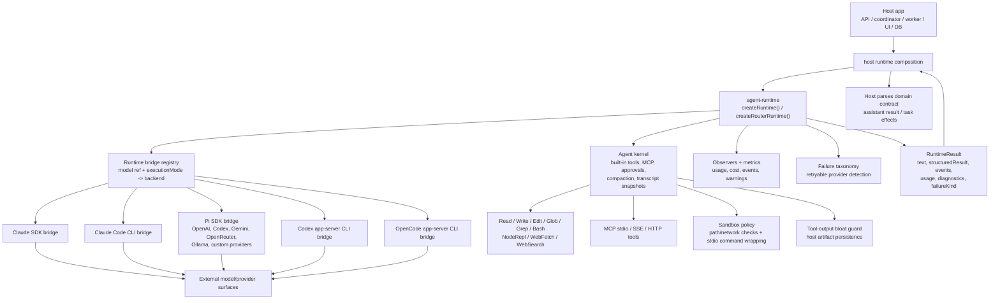
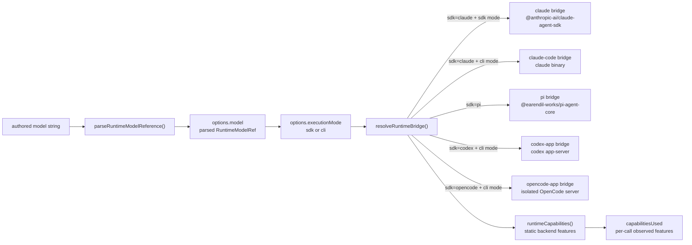
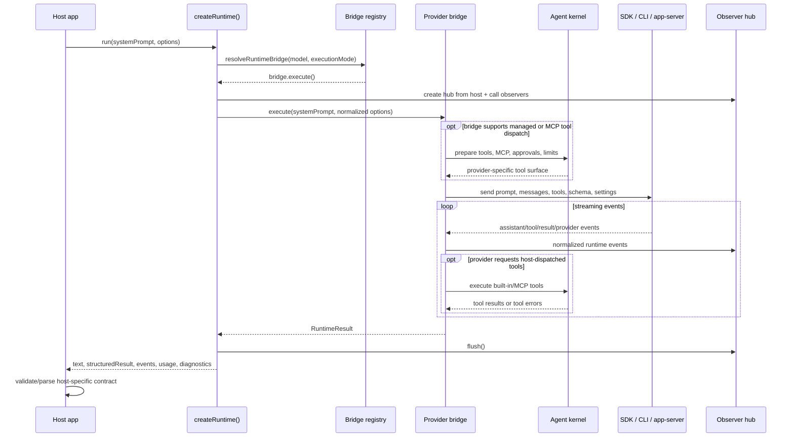
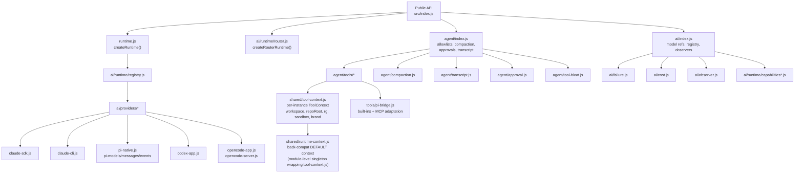
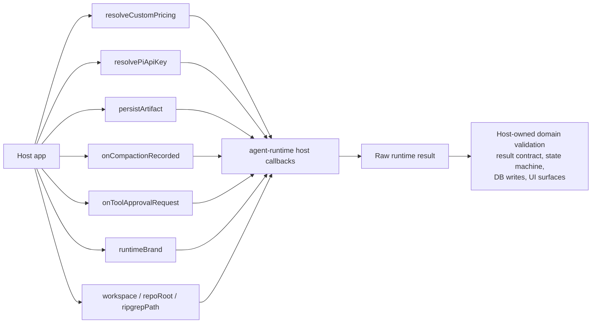

# Agent Runtime Architecture

## What It Is

`@mono-agent/agent-runtime` is a provider-agnostic agent execution
kernel. It does not own tasks, database state, UI, scheduling, or a host's
domain-specific result contract. It owns the lower-level act of running an
agent turn:

- pick the right backend from a model reference and execution mode
- expose built-in tools, MCP tools, approvals, structured output, and live input
- enforce an optional sandbox policy for built-in tool execution and stdio MCP
  startup, through an injectable seam (see `agent/sandbox-seam.js`) rather than
  a bundled sandboxing implementation
- normalize provider events into one runtime event stream
- classify runtime failures and retryable provider errors
- collect usage, cost, cache, capability, and warning telemetry
- return raw text plus raw structured output to the host

Hosts consume the package through `src/runtime.js`. The package has **zero
workspace-package dependencies**: everything a host-side integration would
otherwise need to inject (sandboxing, in this package's case) is expressed as
a plain-data/plain-function seam the host wires up, not an import.

## Package Boundary

**Diagram summary:** A host constructs `createRuntime()` or `createRouterRuntime()`.
The runtime selects one of five provider bridges while sharing observability,
failure normalization, and capability-specific agent-kernel services. It returns
a provider-neutral result for the host to interpret.

The runtime stays below host domain behavior. Provider code in this package
must not import host DB, API, coordinator, or UI modules. Hosts pass callbacks
and pre-resolved settings into the runtime instead.

## Runtime Selection

**Diagram summary:** Hosts may use `parseRuntimeModelReference()` to turn a
canonical string into the object required by `run()`. The static registry then
matches that object plus execution mode and lazily imports Claude SDK, Claude
Code CLI, Pi SDK, Codex app-server, or OpenCode app-server code. Capability
descriptors are available without loading those provider implementations.

Canonical active model references are:

- `claude:<modelId>` for Claude SDK or Claude Code CLI, selected by
  `executionMode`
- `pi:<providerId>:<modelName>` for Pi SDK providers
- `codex:<modelId>` for Codex app-server CLI
- `opencode:<providerId>:<modelName>` for the isolated OpenCode app-server CLI

`createRuntime().run()` expects this already-parsed object; it does not parse a
string implicitly.

Legacy aliases are canonicalized at host ingress when needed. The strict parser
keeps the package boundary honest by rejecting reserved runtime IDs such as
`openai:*`, `vercel:*`, and `claude-code:*`.

## Run Lifecycle

**Diagram summary:** The host calls `run()`, the runtime lazily loads one bridge,
and that bridge talks to its SDK or subprocess. Supported tool calls pass through
the shared kernel, provider events are normalized, and the host receives a result
that it must validate for its domain.

Claude SDK, Claude CLI, and Pi SDK can return provider-captured output as
`structuredResult`. Codex app-server receives the schema but returns its output
as text for the host to parse; direct OpenCode rejects the option. The package
does not validate any captured output against a host domain schema. Hosts own
that validation and all state-machine side effects.

## Main Subsystems

**Diagram summary:** The public barrels lead to the runtime factory, fallback
router, AI registry, and agent-kernel helpers. The registry owns five lazy
provider loaders. Shared agent modules own tools, context, approvals,
compaction, transcript snapshots, and result-size guards; shared AI modules own
failure, cost, observation, and capability metadata.

Key responsibilities by subsystem:

- `runtime.js`: binds host callbacks once, builds a per-instance `ToolContext`
  (`agent/tools/shared/tool-context.js`) threaded to every bridge call via
  `options.toolContext`, and routes each call to the resolved bridge.
- `ai/runtime/registry.js`: keeps the five static bridge descriptors, exposes
  their metadata for introspection, and lazily imports the one whose model
  reference plus execution mode matches a run.
- `ai/runtime/router.js`: retries across an ordered fallback chain on retryable
  provider failures, carrying a transcript-tail resume snapshot forward.
- `ai/providers/*`: owns provider-specific request shapes, event conversion,
  structured-output extraction, native subagent wiring, usage, and diagnostics.
- `agent/tools/*`: implements built-in tools, path/workdir guards, sandbox
  policy checks, MCP tool adaptation, Playwright artifact routing, and output
  limits.
- `agent/sandbox-seam.js`: the injectable `RuntimeSandbox` interface (policy
  merge, command preparation, network-allow checks) and its zero-dependency
  `passthroughSandbox` default (no policy configured → unsandboxed, exactly as
  before; a policy configured with no implementation injected → fails closed).
  Real hosts inject `@mono-agent/runtime-adapter`'s sandbox implementation.
- `agent/compaction.js`: pure helpers consumed by the pi bridge —
  `resolveAgentCompactionPolicy` (derives the context-window compaction trigger +
  adaptive budgets and tool-output payload limits from the typed compaction
  policy and running model; deprecated `agent_compaction_*` settings remain a
  compatibility input), `estimateFixedOverheadTokens` (the proactive fixed-overhead correction:
  system prompt + tool schemas + per-turn message), `isLikelyContextTermination`
  (classifies a context-pressure error), and the typed-policy/`settings`-bag shim
  helpers (`resolveRuntimePolicyInputs`, `deprecatedSettingsWarning`) that let a
  present `toolLimits`/`compaction` object win wholesale per-group over the
  deprecated flat `settings` bag (MIGRATION.md §8). The bridge drives compaction
  itself via `AgentHarness.compact()` (proactive + reactive recovery); the legacy
  in-loop `transformContext` manager was removed.
- `agent/transcript.js`: builds bounded resume snapshots from prior provider
  events so a fallback or continuation can keep context.
- `agent/approval.js`: provides host-driven human-in-the-loop tool approval
  gates where the backend supports runtime tool dispatch.
- `ai/failure.js`: normalizes spawn, usage-limit, provider, cancellation, and
  retryability decisions into stable failure kinds.

## Host Responsibilities

**Diagram summary:** The host injects pricing, Pi credentials, artifact and
compaction persistence, tool-approval decisions, runtime branding, and allowed
filesystem roots. The runtime returns raw normalized data; the host owns domain
validation, durable state, and UI effects.

The host is responsible for:

- resolving credentials and custom provider/model rows before provider calls
- choosing model references, execution mode, effort, fallback chains, and
  runtime settings
- persisting artifacts, raw logs, run rows, and UI-facing state (via the
  `onCompactionRecorded` hook, which fires on every automatic compaction —
  proactive or reactive — the pi bridge drives)
- validating structured output against the host's domain contract
- converting runtime failures into product workflow behavior
- deciding when to retry, recover, continue, cancel, or ask for user input

## Sessions, Follow-ups & Concurrency

When `runtime.session.mode = "continuous"`, the harness keeps a conversation's
provider session warm and serializes its turns through a per-conversation queue
(`@mono-agent/agent-harness` `LiveSessionManager`). A message that arrives while
a turn is in flight is **queued and answered on the warm session after the
current turn finishes** (queue-after-turn) rather than rejected — this is what
powers follow-up messages in chat channels. Different conversations run
concurrently; an optional `concurrency.maxConcurrentRuns` bounds simultaneous
model runs via admission control around the provider call (queued follow-ups
hold no slot, so the bound never deadlocks against the queue). Note this bound is
**per harness instance** — the app builds one harness per channel, so the limiter
is per-channel, not a single global cap; with N enabled channels the effective
ceiling is N× the configured value. Channels surface
a user cancel through `responder.cancel(conversationId)`, which aborts the
in-flight turn and clears that conversation's queue.

**Honest per-provider session behavior** — parity is *behavioral* (every
provider exposes queue-after-turn), not durability/cost:

The pi runtime is built on pi-agent-core's native `AgentHarness` (the hand-rolled
bridge was removed once native reached parity); it owns the session and
pi-ai-managed retry. `AgentHarness` itself has **no** automatic compaction, so
the pi bridge drives it through a one-shot `session_before_compact` hook: before
each turn it compares the full request estimate with an adaptive trigger, and if
a turn still overflows it retries exactly once only after a preview verifies a
positive reduction. Runs report `context_compaction_applied` as `true` (a
compaction fired), `false` (enabled but not needed), or `null` (disabled via
`runtime.compaction.enabled: false`).

| Provider | Warm session | Resume across turns | Survives process restart |
|---|---|---|---|
| **pi** | Yes (pi `AgentHarness` + JSONL session repo) | session repo | Yes only with `piSessionsRoot` and the durable history/session transaction contract |
| **claude-sdk** | No persistent process (stream closes at turn end) | `queryOptions.resume` | No (Anthropic-side id) |
| **claude-cli** | No — respawns `claude --resume` per turn (re-inits MCP) | `--resume` replay | No |
| **codex-app** | Live subprocess thread (dies with the subprocess) | next turn on the thread, else replay | No |
| **opencode-app** | No — every run uses an isolated server and private database | Unsupported | No |

Claude CLI and Codex only *approximate* a warm session (resume/replay), so do
not assume warm-session latency wins there. Direct OpenCode is intentionally
stateless across runs.

## Essential Takeaway

Think of `@mono-agent/agent-runtime` as the portable agent process engine
underneath a host app. The host decides what a task means, which agent should
run, how state changes, and how results are persisted. The runtime decides how
to talk to Claude, Pi, Codex, and OpenCode execution surfaces; how tools are
exposed; how provider failures are normalized; and how enough telemetry is
returned for a host to make reliable orchestration decisions.
